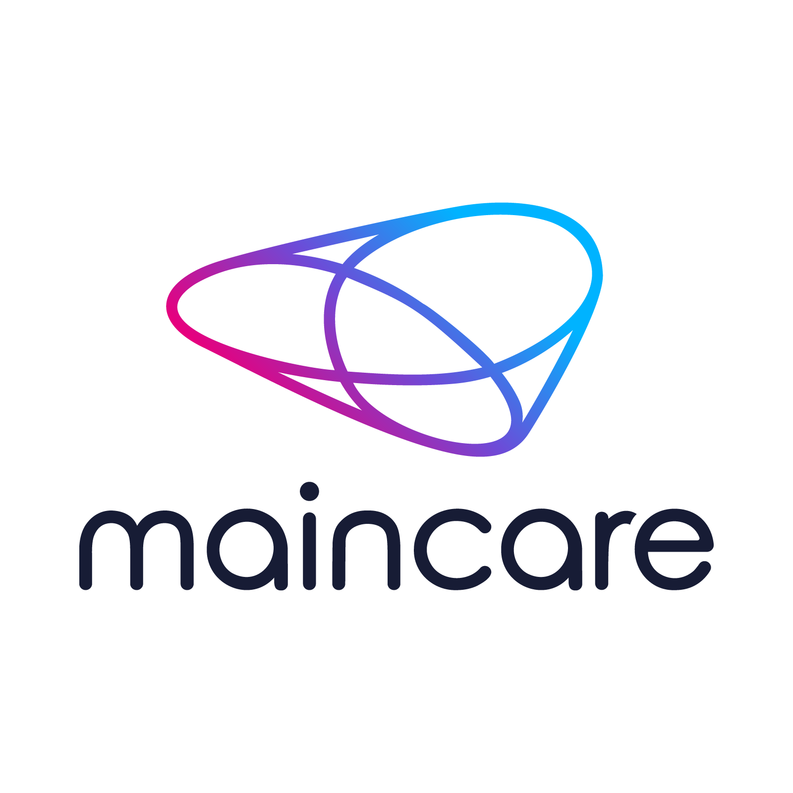

### Hi there 👋

<!--
**juliengdt/juliengdt** is a ✨ _special_ ✨ repository because its `README.md` (this file) appears on your GitHub profile.

Here are some ideas to get you started:

- 🔭 I’m currently working on ...
- 🌱 I’m currently learning ...
- 👯 I’m looking to collaborate on ...
- 🤔 I’m looking for help with ...
- 💬 Ask me about ...
- 📫 How to reach me: ...
- 😄 Pronouns: ...
- ⚡ Fun fact: ...
-->

### Ahoy!  
I'm Julien and I'm a 7+ yrs iOS engineer.
I'm interested in simple user interface, nice and clean code, but all deep things "under the hood" too, such as CI/CD, xcoproj management ... and much more !  

For the past few years i'm convince my job can be useful for medical applications, so i joined Sweepin (FR) and more recently, the Maincare (FR) family !     

Gimme a poke, i'll be happy to talk about iOS development (or anything else).

See ya 🤟

Twitter: (@jlngdt)[https://twitter.com/jlngdt]
